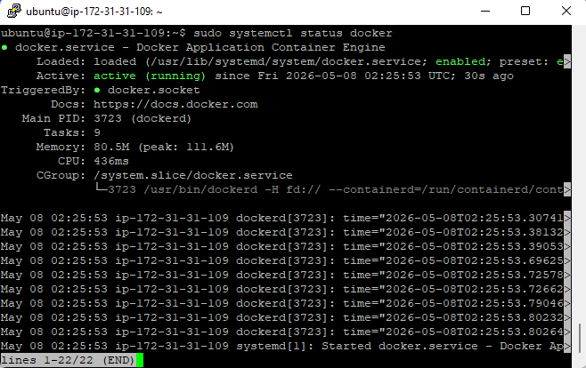
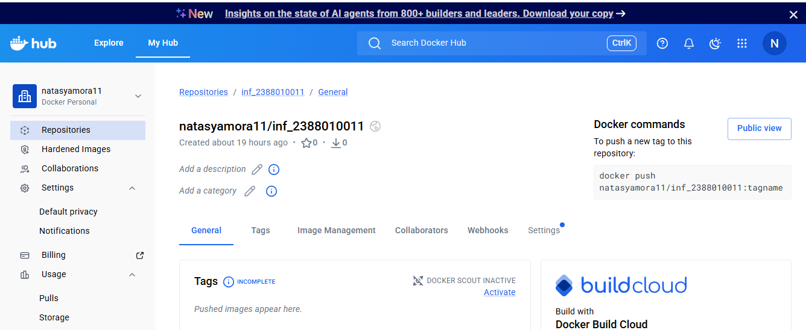
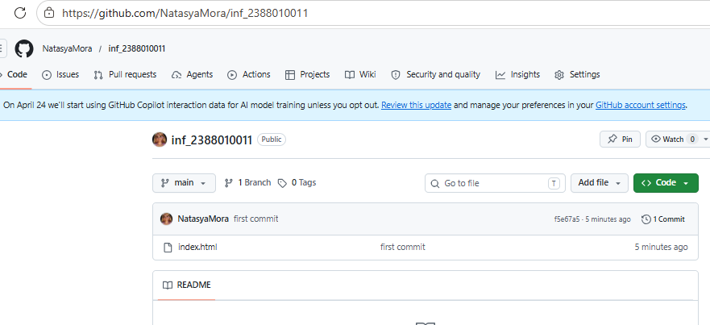
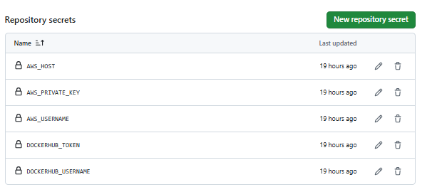
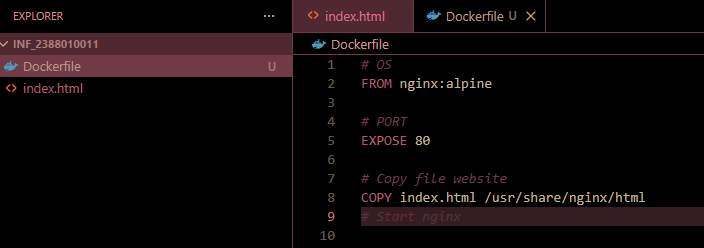
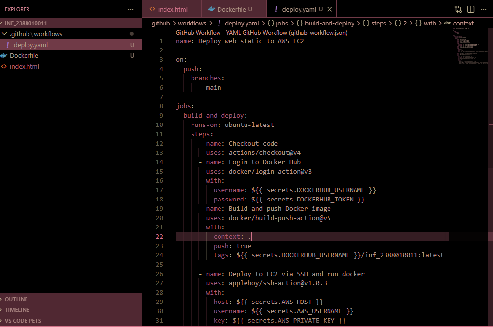
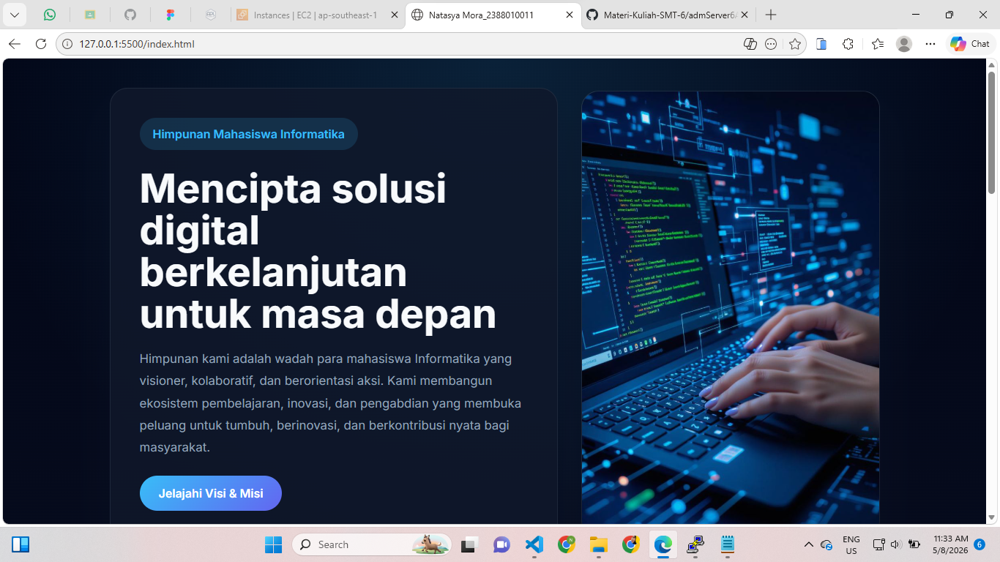

# CI/CD dengan Git -> Github Actions -> Docker hub -> EC2 AWS

1. start instance
2. patching os -> sudo apt update && sudo apt upgrade
3. install docker di EC2 AWS https://docs.docker.com/
 - uninstall docker old version (sudo apt remove $(dpkg --get-selections docker.io docker-compose docker-compose-v2 docker-doc podman-docker containerd runc | cut -f1))
 - set up apt docker
 - install docker engine
 - cek docker -> systemctl status docker

4. Create Gudang / Repo di Docker Hub https://hub.docker.com/
 - Create akun dan login
 - create repo -> (hub->repo->New)
 - Create Tokens ( Klik Profile->Account Setting ->Security ->Access Tokens -> Generate new token)
 - Simpan token jangan sampai hilang

5. Create Repo di Github
 - Membuat Repo baru dengan nama himafor_nim
 - Buat projek di Local
 - Push ke Github

6. Set Up Github Secret Variables
 - Klik Repo -> Settings -> Secrets and variables -> Actions -> New repository secret
 - buat secret "DOCKERHUB_USERNAME" with your Docker Hub username
 - buat secret "DOCKERHUB_TOKEN" with your Docker Hub token
 - AWS_USERNAME isi username EC2 AWS kamu (ubuntu)
 - AWS_PRIVATE_KEY isi private key
 - AWS_HOST isi public IP EC2 AWS kamu 

7. Membuat Resep lingkungan Pengembangan (Dockerfile)
 - Buat file Dockerfile di root repo kamu
 - Isi Dockerfile dengan kode berikut:
    From nginx:alpine
    Expose 80
    Copy index.html /usr/share/nginx/html 

8. Membuat CI/CD Workflow (Github Actions) di Repositori Github
 - Buat folder .github/workflows/
 - Buat File deploy.yml di folder .github/workflows/
 - Isi deploy.yml dengan kode berikut: 

9. Pastikan semua tidak ada konflik termasuk permission
 - Stop dan disable nginx -> sudo systemctl stop nginx
 - sudo systemctl disable nginx
 - add ubuntu to docker group -> sudo usermod -aG docker ubuntu
 - commit dan push -> dan cek di website
