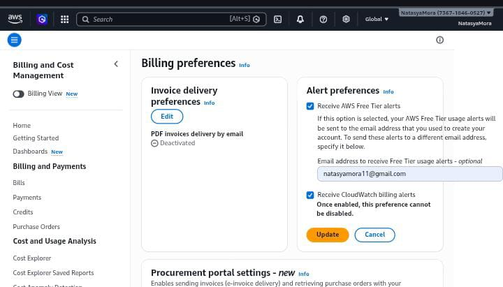
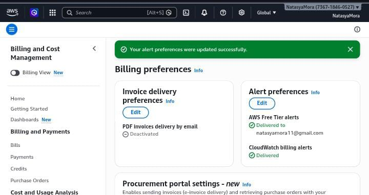
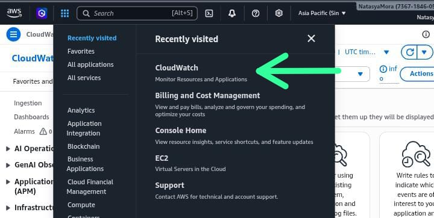
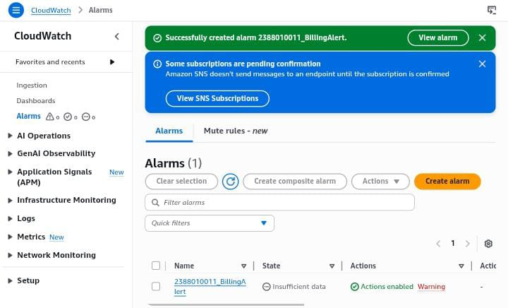

# Membuat Billing alert di aws untuk menghindari kelebihan alokasi dana

1. Menu dashboard aws kita pilih billing preference untuk mengaktifkan Alert
- Masuk menu billing dan cost manajemen
- pilih menu alert preferences klik edit
- isi email ceklis receive
- klik update

2. Masuk menu cloudwatch, all services pilih cloudwatch

3. Pilih Menu Create Alarm

- Pastikan Region ada di US N Virginia
- Klik Menu Create ALert
- Klik Metric
- Klik Menu Billing
- Pilih Menu Total Estimated Charge
- Pilih / Ceklis Mata Uang USD
- Klik Select Metric
- beri nama Alert = NIM_BillingAlert
- COnditions Static->Greathertha-> 1 USD
- Create new Topic = > NIM_BillingAlert -> Klik Create
- Select an existing SNS topic - > NIM_BillingAlert
- Klik Next
- Alarm Name -> NIM_BillingAlert
- Create Alarm
- Buka Inbox/Spam Email dari AWS kemudian Klik Confirm

