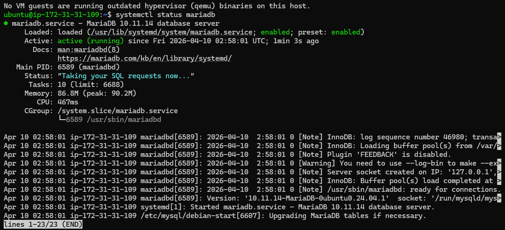
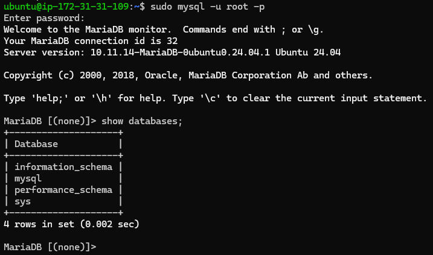
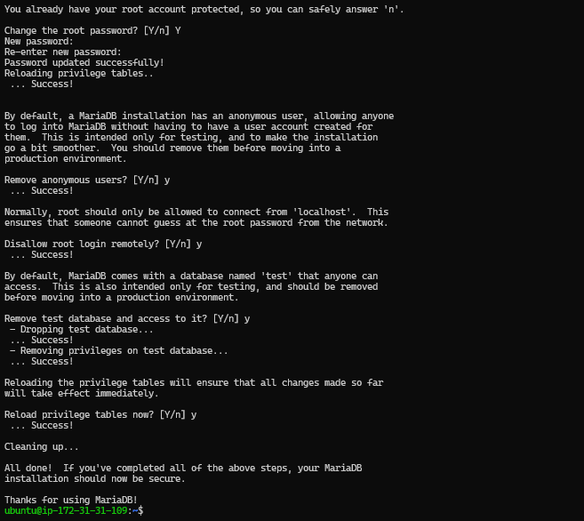
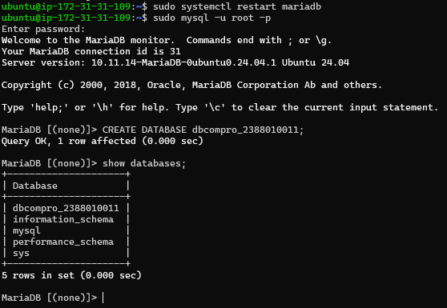
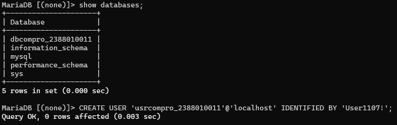
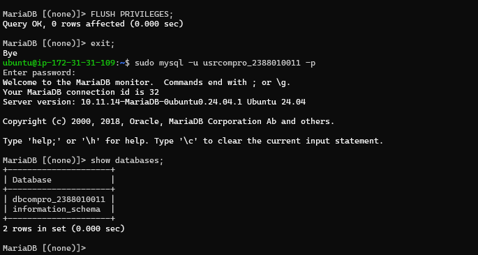

# Setting up Database di aws ec2 menggunakan MariaDb

1. aktifkan instance aws ec2
2. remote via ssh powershell / putty
3. patching os (sudo apt-get update && sudo apt-get upgrade)
4. install MariaDb (sudo apt install mariadb-server -y)
5. cek status mariaDb (systemctl status mariadb)

6. test default setting database server login (sudo mysql -u root -p)

7. hardening database server sudo (mysql_secure_installation)
    - Change the password for the root user = Y
    - Remove anonymous users = Y
    - Disallow root login remotely = Y
    - Remove test database and access to it = Y
    - Reload privilege tables = Y

8. create DB website company profile
    - login sebagai root
    - create db nama dbcompro_NIM => CREATE DATABASE dbcompro_NIM;

    - create user dengan nama = usrcompro_NIM dan password = [PASSWORD] => CREATE USER 'usrcompro_NIM'@'localhost' IDENTIFIED BY '[PASSWORD]';

    - Grant user akses ke DB yang baru dibuat => GRANT ALL PRIVILEGES ON dbcompro_NIM.* TO 'usrcompro_NIM'@'localhost';
    - Flush privileges => FLUSH PRIVILEGES;
    - exit;
    - login sebagai usrcompro_NIM dan cek apakah bisa akses ke DB yang baru dibuat
