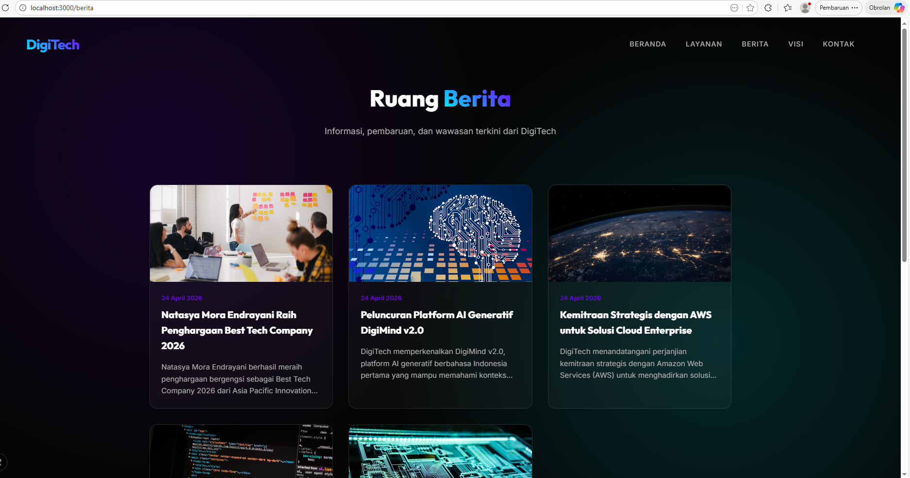

# Deploy Web Apps Framework Next.js ke AWS

1. Pastikan Web Apps berjalan di local
    - install dependensi npm install
    - create db dan import sql
    - jalankan web apps npm run dev
    - akses web apps di browser 'https://localhost:3000'
    - testing Front-End pastikan tampilan muncul tanpa error
2. Testing Back-End -> 'http://localhost:3000/api/berita'
    - user: admin
    - password: admin123 
    - Create static fFIle -> 'npm run build'
    - Archive Folder standalone -> ZIP -> klik kanan folder sandalone -> send to -> compressed (zuooed) folder.
    
