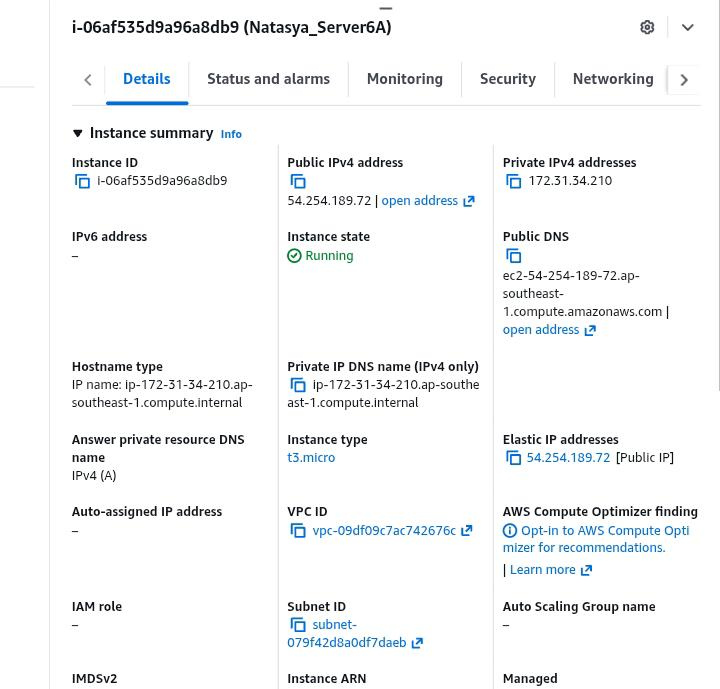
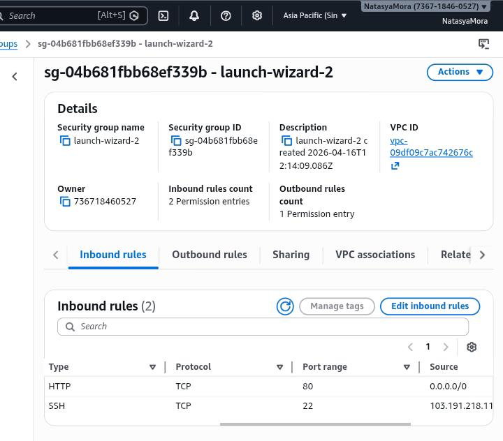
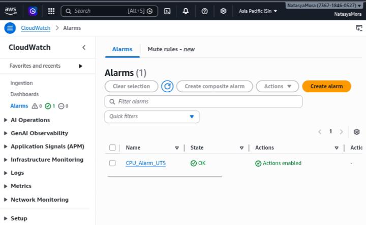
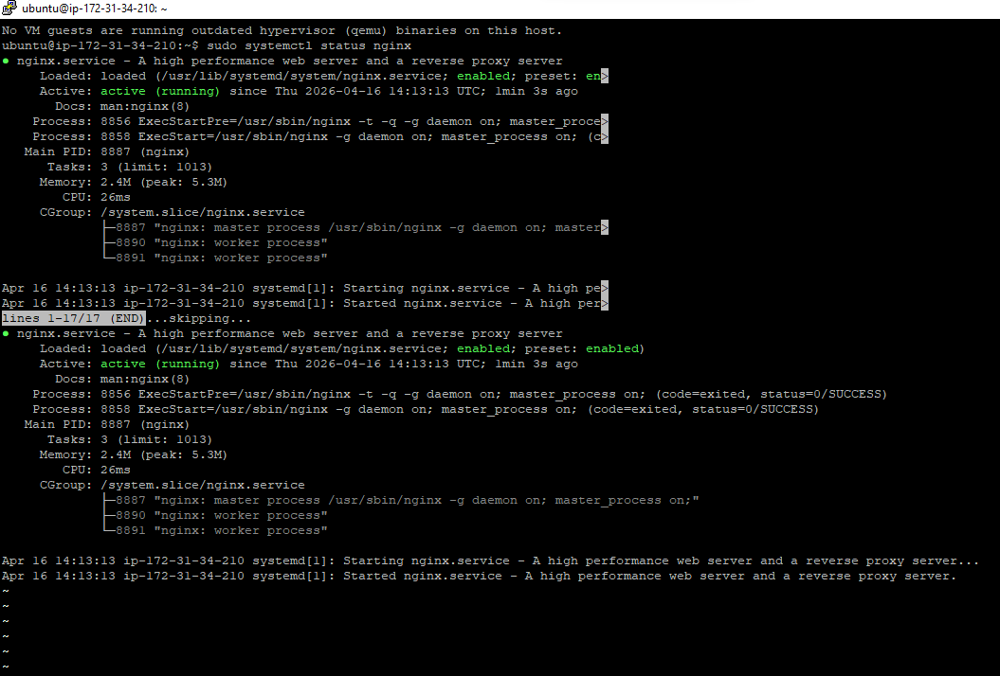

# Bukti Log & Keamanan

1. Screenshot halaman utama AWS EC2 Console (menunjukkan Instance ID, status Running, dan Elastic IP)

2. Screenshot halaman Security Group Inbound Rules (menunjukkan Port 22 hanya diakses oleh My IP).

3. Screenshot halaman CloudWatch Alarms (menunjukkan alarm CPU berstatus OK atau hijau).

4. Screenshot Terminal/PuTTY saat Anda berhasil mengeksekusi perintah sudo systemctl status nginx.
